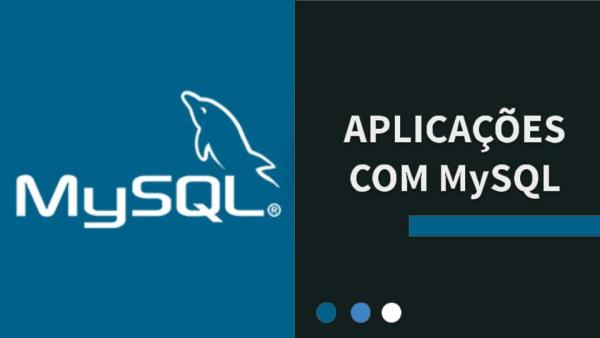

  

https://github.com/iurygdeoliveira/MySQL
## Desenvolvedor (Developer):

## Descrição do Repositorio (Description of the Repository)

Programas em MySQL (MySQL Programs)

## Sumário dos Programas (Summary of programs)

- LINGUAGEM DCL: https://github.com/iurygdeoliveira/MySQL/tree/master/Linguagem%20DCL (08/08/2020)

- FULL TEXT SEARCH: https://github.com/iurygdeoliveira/MySQL/tree/master/Full%20Text%20Search (07/08/2020)

- TRIGGERS: https://github.com/iurygdeoliveira/MySQL/tree/master/Triggers (05/08/2020)

- TRATAMENTO DE EXCEÇÕES: https://github.com/iurygdeoliveira/MySQL/tree/master/Tratamento%20de%20Exce%C3%A7%C3%B5es (30/06/2020)

- ESTRUTURAS DE REPETIÇÃO: https://github.com/iurygdeoliveira/MySQL/tree/master/Estruturas%20de%20Repeti%C3%A7%C3%A3o (30/05/2020)

- FUNCTIONS: https://github.com/iurygdeoliveira/MySQL/tree/master/Functions (27/05/2020)

- STORED PROCEDURE: https://github.com/iurygdeoliveira/MySQL/tree/master/Stored%20Procedure (22/05/2020)

- VIEWS: https://github.com/iurygdeoliveira/MySQL/tree/master/Views (20/05/2020)
